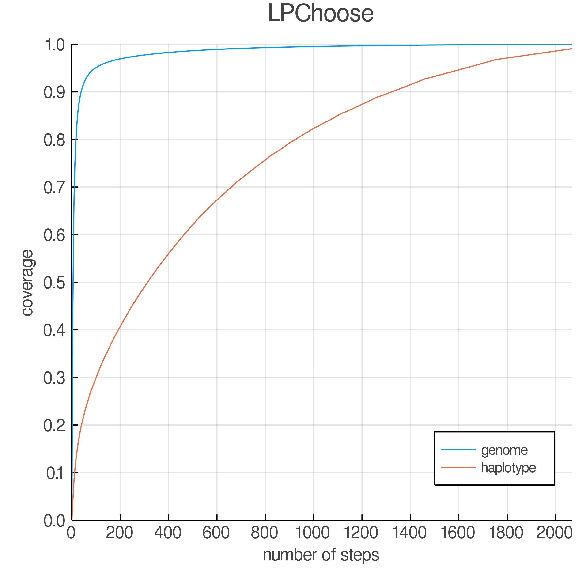
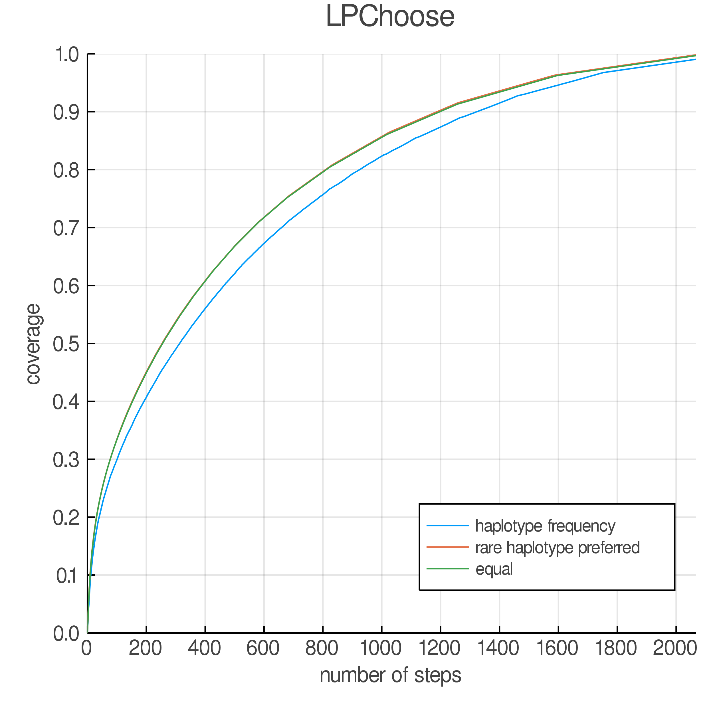

# A Tutorial on running LPChoose in Julia

The LPChoose package is able to choose animals for sequencing given haplotype information using linear programming. There are two applications in this package: 1) identify minimum number of animals containing all unique haplotypes in the population; 2) identify a fixed number of animals whose haplotypes include as large a proportion as possible of the haplotypes present in the population given a limited budget.

## Installation

### Install Julia

Julia is publicly available at https://julialang.org/downloads/. Install the proper version for your computer operating system.

### Install LPChoose

You can download the LPChoose package from Github https://github.com/reworkhow/LPChoose.jl.


Or you can download it using the command line in Terminal: git clone https://github.com/reworkhow/LPChoose.jl.git.

After installing LPChoose, several packages are required before running: DataFrames, LinearAlgebra, CSV, DelimitedFiles, SparseArrays, GLPK, JuMP, Statistics, StatsBase, ProgressMeter

You can download the packages in Julia as follows if they are not on your computer yet (using GLPK as an example):


```julia
using Pkg
Pkg.add("GLPK")
```

The other packages can be downloaded similarly. Use the following code to check if you have all the packages:


```julia
using DataFrames,LinearAlgebra,CSV,DelimitedFiles,SparseArrays,GLPK,JuMP,Statistics,StatsBase,ProgressMeter
```

If the code runs without an error, then all the packages are ready. 

## Run LPChoose

Now we are all set to go! Let's use the example dataset in LPChoose (smalldata.txt) to demonstrate the function. First set the working directory where LPChoose.jl locates (If you download LPChoose using Terminal, the package name is "LPChoose.jl"; If you download LPChoose from the Github webpage, the name is "LPChoose.jl-master" and the working directory should be "~/LPChoose.jl-master") and use `include` function to load LPChoose functions.


```julia
cd("~/Desktop/LPChoose.jl")
include("LPChoose.jl")
```


We can check the detailed information of LPChoose using the help function (?) in Julia.


```julia
?LPChoose
```
    


```
LPChoose(hapblock,budget=100,MAF=0.0;
         nsteps= (budget=="unlimited" ? 1 : Int(ceil(budget/2)),
         preselected_animals    = false,
         weights_for_haplotypes = "haplotype frequency",
         sequencing_homozygous_haplotypes_only = false)
```

  * Choose animals for sequencing given haplotype information **hapblock** filterd by minor haplotype frequency **MAF** for two applications:

      * identify minimum number of animals containing all unique haplotypes in the population if `budget = "unlimited"`;
      * identify a fixed number of animals whose haplotypes include as large a proportion as possible of the haplotypes present in the population given a limited **budget**, defaulting to `100` (100 animals).
  * If a text file is provided for **hapblock**, the file format should be:

      * ```
        1,1,1,1,4       #ind1, hap1_1, hap1_1, hap2_1, hap2_4
        2,2,1,1,2       #ind2, hap1_2, hap1_1, hap2_1, hap2_2
        3,1,3,2,3       #ind3, hap1_1, hap1_3, hap2_2 hap2_3
        ```

    where individual IDs (they are required to be intergeres) are in 1st column, maternal and paternal haplotypes   for haplotype block 1 are in column 2-3, maternal and paternal haplotypes for haplotype block 2 are in column 4-5.
  * MISC

      * A fast approximation may be used to speed up computation in practice to select a fixed number of animals. This approximation is performed by selecting **budget** animals in multiple steps by selecting `budget_each_step` animals at each step, defaulting to `2`. For example, we can select 2 animals in each step to select 100 animals with 100/2=50 steps.
      * A list of preselected animals can be provided as an array of animal IDs for **preselected_animals**.
      * To identify a fixed number of animals, multiple options for `weights_for_haplotypes` are available, including "haplotype frequency" (default), "rare haplotype preferred", and "equal".
      * If `sequencing_homozygous_haplotypes_only`=`true`, LPChoose will only focus on sequencing homozygous haplotype segments to achieve a reduction in cost with an added benefit of phasing variant calls efficiently (Bickhart et al. 2015).


### Application 1: Identify minimum number of animals containing all unique haplotypes


```julia
LPChoose("smalldata.txt", "unlimited")
```

    --------------INPUT----------------------------
    #Animal:6000
    #Unique Haplotypes:27473
    Haplotype Frequency Summary Stats:
    Length:         27473
    Missing Count:  0
    Mean:           0.007139
    Minimum:        0.000167
    1st Quartile:   0.000167
    Median:         0.000500
    3rd Quartile:   0.002000
    Maximum:        0.353000
    
    --------------QUALITY CONTROL-------------------
    ----------minor haplotype frequency: 0.0--------
    #Animal:6000
    #Unique Haplotypes:27473
    Haplotype Frequency Summary Stats:
    Length:         27473
    Missing Count:  0
    Mean:           0.007139
    Minimum:        0.000167
    1st Quartile:   0.000167
    Median:         0.000500
    3rd Quartile:   0.002000
    Maximum:        0.353000
    
    ---------------1ST APPLICATION--------------------
    -------identify minimum number of animals---------
    -------containing all unique haplotypes----------
    -----------RUN LINEAR PROGRAMMING-----------------
    
    It took 12.537615 seconds (942.22 k allocations: 121.610 MiB, 0.53% gc time)
    
    The minimum number of selected animals is: 4135
    
    IDs for identified animals were saved in identified_animals.txt.
    
    ---------------------DONE-------------------------


The minimum number of animals covering all the unique haplotypes is 4135.

### Application 2: Identify a fixed number of animals including as many as possible of the haplotypes given a limited budget


```julia
LPChoose("smalldata.txt",10)
```

    --------------INPUT----------------------------
    #Animal:6000
    #Unique Haplotypes:27473
    Haplotype Frequency Summary Stats:
    Length:         27473
    Missing Count:  0
    Mean:           0.007139
    Minimum:        0.000167
    1st Quartile:   0.000167
    Median:         0.000500
    3rd Quartile:   0.002000
    Maximum:        0.353000
    
    --------------QUALITY CONTROL-------------------
    ----------minor haplotype frequency: 0.0--------
    #Animal:6000
    #Unique Haplotypes:27473
    Haplotype Frequency Summary Stats:
    Length:         27473
    Missing Count:  0
    Mean:           0.007139
    Minimum:        0.000167
    1st Quartile:   0.000167
    Median:         0.000500
    3rd Quartile:   0.002000
    Maximum:        0.353000
    
    ---------------2ND APPLICATION--------------------
    ------------identify best 10 animals--------------
    --representing maximum proportions of haplotypes--
    -----------RUN LINEAR PROGRAMMING-----------------
    


    identifying most representative animals ...100%|████████| Time: 0:00:05


    
    0.05023113602446039 of the unique haplotypes in the population is covered.
    0.5006245666272382 of the genome in the population is covered.
    
    IDs for identified animals were saved in identified_animals.txt.
    
    ---------------------DONE-------------------------


When we have a budget to sequence 10 animals, only 5% of the haplotypes can be covered. Next let's try 4135, the solution we obtain from Application 1.


```julia
LPChoose("smalldata.txt",4135)
```

    --------------INPUT----------------------------
    #Animal:6000
    #Unique Haplotypes:27473
    Haplotype Frequency Summary Stats:
    Length:         27473
    Missing Count:  0
    Mean:           0.007139
    Minimum:        0.000167
    1st Quartile:   0.000167
    Median:         0.000500
    3rd Quartile:   0.002000
    Maximum:        0.353000
    
    --------------QUALITY CONTROL-------------------
    ----------minor haplotype frequency: 0.0--------
    #Animal:6000
    #Unique Haplotypes:27473
    Haplotype Frequency Summary Stats:
    Length:         27473
    Missing Count:  0
    Mean:           0.007139
    Minimum:        0.000167
    1st Quartile:   0.000167
    Median:         0.000500
    3rd Quartile:   0.002000
    Maximum:        0.353000
    
    ---------------2ND APPLICATION--------------------
    ------------identify best 4135 animals--------------
    --representing maximum proportions of haplotypes--
    -----------RUN LINEAR PROGRAMMING-----------------
    


    identifying most representative animals ...100%|████████| Time: 0:02:16


    
    0.990572562151931 of the unique haplotypes in the population is covered.
    0.9997799146170684 of the genome in the population is covered.
    
    IDs for identified animals were saved in identified_animals.txt.
    
    ---------------------DONE-------------------------


Now 99% of the haplotypes are covered. Ideally 100% should be covered since the budget is set as the value we obtain from Application 1, but Application 2 uses an approximation method to significantly decrease the computation time when keeping the solution close enough to the true one. We can plot the genome and haplotype coverage at each step.

> Note: When running LPChoose multiple times without changing working directory, the output files will be replaced by the newest ones automatically.


```julia
using Plots
genome_coverage    = "genome_coverage.txt"
haplotype_coverage = "haplotype_coverage.txt"
steps  = readdlm(genome_coverage,',',header=true)[1][:,1]
g      = readdlm(genome_coverage,',',header=true)[1][:,2]
h      = readdlm(haplotype_coverage,',',header=true)[1][:,2]
nsteps = length(g)

line_plot=plot(size=(500,500),
     xlim=(0,nsteps),ylim=(0,1),
     xaxis = (font(10), 0:200:nsteps),yaxis = (font(10), 0:0.1:1),
     title="LPChoose",
     ylabel = "coverage",xlabel = "number of steps",
     legend=:bottomright
)

plot!(steps,g,markercolor=:green,label="genome")
plot!(steps,h,markercolor=:red,label="haplotype")
savefig(line_plot,"line_plot.png")
```





### Other options for LPChoose

To identify a fixed number of animals in Application 2, multiple options for weights_for_haplotypes are available, including "haplotype frequency" (default; Cheng et al., 2020), "rare haplotype preferred" (Bickhart et al. 2016), and "equal" (all weights equal to 1). It can be defined by the user as well. Below is the haplotype coverage on the example dataset for the three options.



LPChoose can also focus on sequencing only homozygous haplotype segments to achieve a reduction in cost with an added benefit of phasing variant calls efficiently (Bickhart et al. 2016) by setting sequencing_homozygous_haplotypes_only=true.

## References

Bickhart, D.M., Hutchison, J.L., Null, D.J., VanRaden, P.M. and Cole, J.B., 2016. Reducing animal sequencing redundancy by preferentially selecting animals with low-frequency haplotypes. Journal of Dairy Science, 99(7), pp.5526-5534.

Cheng, H., Xu, K. and Abraham, K.J., 2020. Optimizing Sequencing Resources in Genotyped Livestock Populations Using Linear Programming. BioRxiv.
